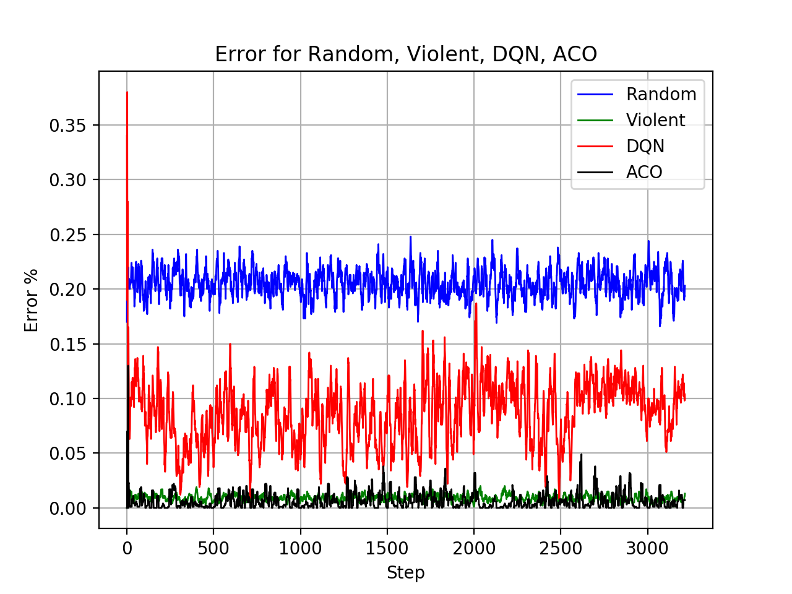

# sfc-dqn

This repository is the tensorflow implementation of paper SFC-DQN.

Following is an introduction to the files:

* env.py: Environment for simulating SFC chain assignment.
* config.py: Presettings of bandwidth, delay and sfc requests
* dqn.py: Core code for DQN algorithm.
* train.py: Run this file to train DQN Agent: <code>python train.py</code>. It will load checkpoint files from ckpt/ and continue training, and save checkpoint in ckpt/ automatically.
* ckpt: Folder to store pre-training parameters. Required when run eval.py, main.py and gen_qoe.sh.
* eval.py: Evaluate the mean QoE and error rate of DQN alone, with 100 random generated sfc requests. Try <code>python eval.py</code> to see mean QoE and error rate. If run via cpu, the complete time of DQN might be longer.
* random_sfc.py: Contrast algorithm realized by stochastic principle. Try <code>python random_sfc.py</code> to see mean QoE and error rate.
* violent_sfc.py: Contrast algorithm realized by violence principle. Try <code>python violent_sfc.py</code> to see mean QoE and error rate.
* main.py: Run DQN, Random, Violent with 100 random generated sfc requests, and output: 
```
QoS of Random, Error of Random, QoS of Violent, Error of Violent, QoS of DQN, Error of DQN
```
Try <code>python main.py</code>.
* gen_qoe.sh: A simple Linux shell to generate comparative data and append to output.txt.
* output.txt: Comparative data. Used for ploting qoe and error rate.
* plot_qoe.py: Used to draw average QoE curve. Try <code>python plot_qoe.py</code>, it will load logs from output.txt and plot:



* plot_error.py: Used to draw error rate curve. Try <code>python plot_error.py</code>, it will load logs from output.txt and plot:


