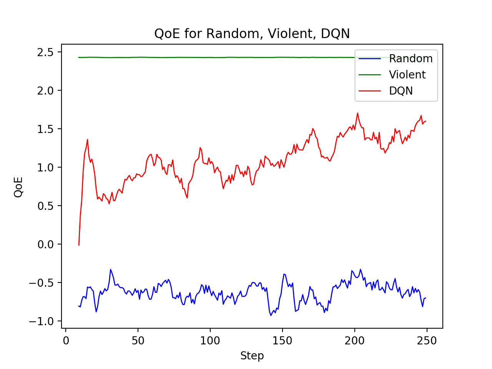
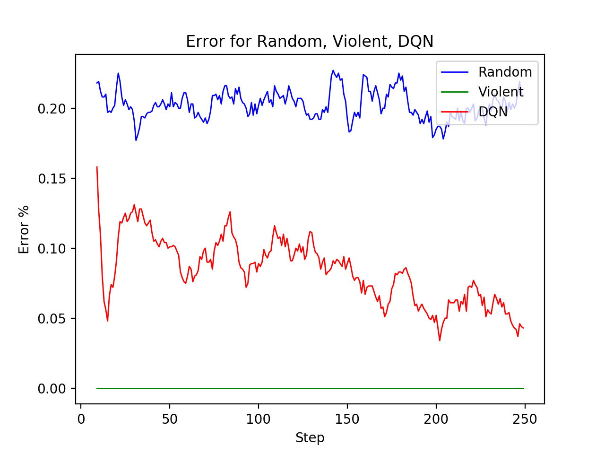
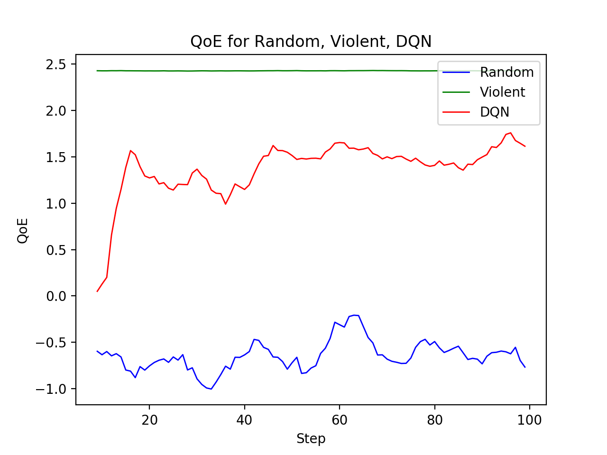
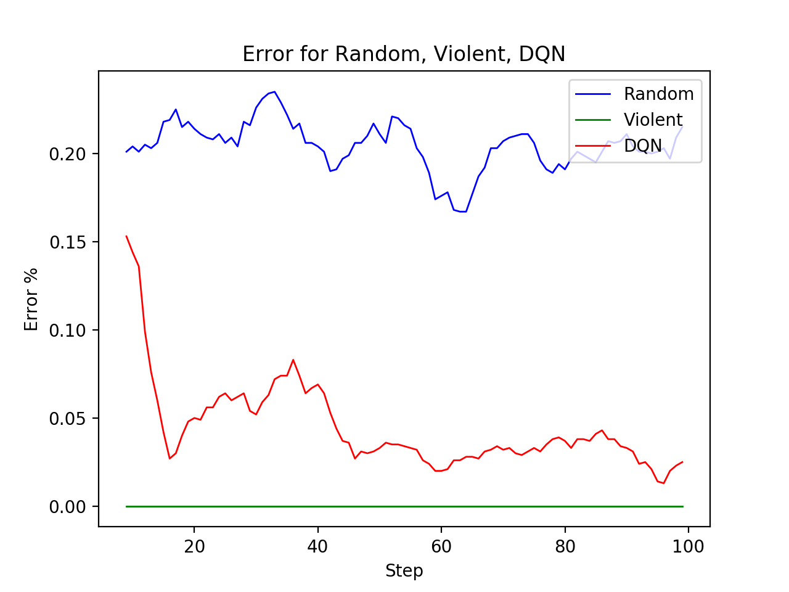

# sfc-dqn

This repository is the tensorflow implementation of paper Reinforcement Learning based QoS/QoE-aware Service Function Chaining in Software-Driven 5G Slices.

Following is an introduction to the files:

* env.py: Environment for simulating SFC chain assignment.
* config.py: Presettings of bandwidth, delay and sfc requests
* dqn.py: Core code for DQN algorithm.
* train.py: Run this file to train DQN Agent alone: <code>python train.py</code>. It will load checkpoint files from ckpt/ and continue training, and save checkpoint in ckpt/ automatically. Note: use main.py instead.
* ckpt: Folder to store pre-training parameters. Required when run eval.py, main.py.
* eval.py: Evaluate the mean QoE and error rate of DQN alone, with 100 random generated sfc requests. Try <code>python eval.py</code> to see mean QoE and error rate. If run via cpu, the complete time of DQN might be longer.
* random\_sfc.py: Contrast algorithm realized by stochastic principle. Try <code>python random\_sfc.py</code> to see mean QoE and error rate.
* violent\_sfc.py: Contrast algorithm realized by violence principle. Try <code>python violent\_sfc.py</code> to see mean QoE and error rate.
* main.py: Run DQN, Random, Violent with 100 random generated sfc requests several times, at the same time train DQN agent. During the training, append logs to output.txt: 
```
(STEP1)QoS of Random, Error of Random, QoS of Violent, Error of Violent, QoS of DQN, Error of DQN
(STEP2)QoS of Random, Error of Random, QoS of Violent, Error of Violent, QoS of DQN, Error of DQN
(STEP3)QoS of Random, Error of Random, QoS of Violent, Error of Violent, QoS of DQN, Error of DQN
(STEP4)QoS of Random, Error of Random, QoS of Violent, Error of Violent, QoS of DQN, Error of DQN
(STEP5)QoS of Random, Error of Random, QoS of Violent, Error of Violent, QoS of DQN, Error of DQN
...
```
Try <code>python main.py</code>.
* output.txt: Comparative data generated during the training process. Used for ploting qoe and error rate.
* plot\_qoe.py: Used to draw average QoE curve, smooth rate 0.1. Try <code>python plot\_qoe.py</code>, it will load logs from output.txt and plot:

<div align="center"></div>

* plot\_error.py: Used to draw error rate curve, smooth rate 0.1. Try <code>python plot\_error.py</code>, it will load logs from output.txt and plot:

<div align="center"></div>

After repeated retraining, we find a better result:

<div align="center"></div>

<div align="center"></div>
